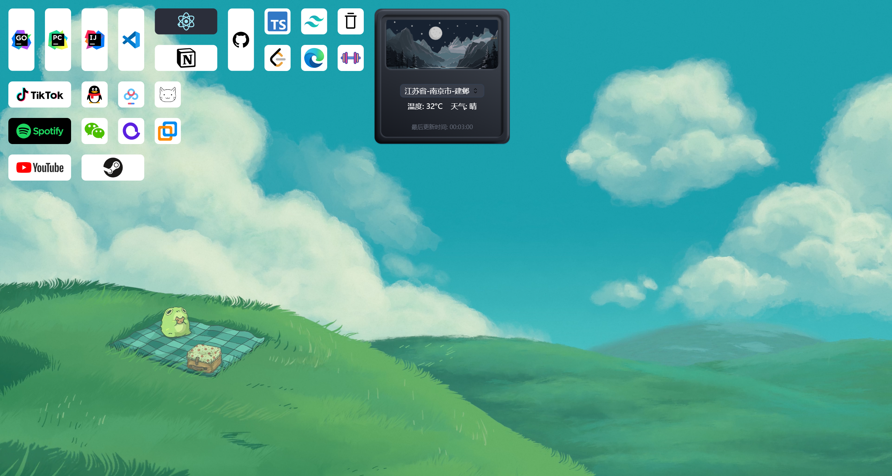

# DeskIsle

> A desktop widget for Windows, where efficiency and elegance coexist.

## Development Guide

### Environment

- node v21.4.0

- Visual Studio 2022 C++ desktop development environment

- Platform: Windows 11

### Install

`cd DeskIsle`

`npm i`

### Dev

`npm run start`

## Packages

- [React18](https://react.dev/)

- [Typescript](https://www.typescriptlang.org/)

- [Tailwindcss](https://www.tailwindcss.cn/)

- [Shadcn](https://ui.shadcn.com/)

- [jotai](https://jotai.jscn.org/)

- [Framer-Motion](https://www.framer.com/motion/)
